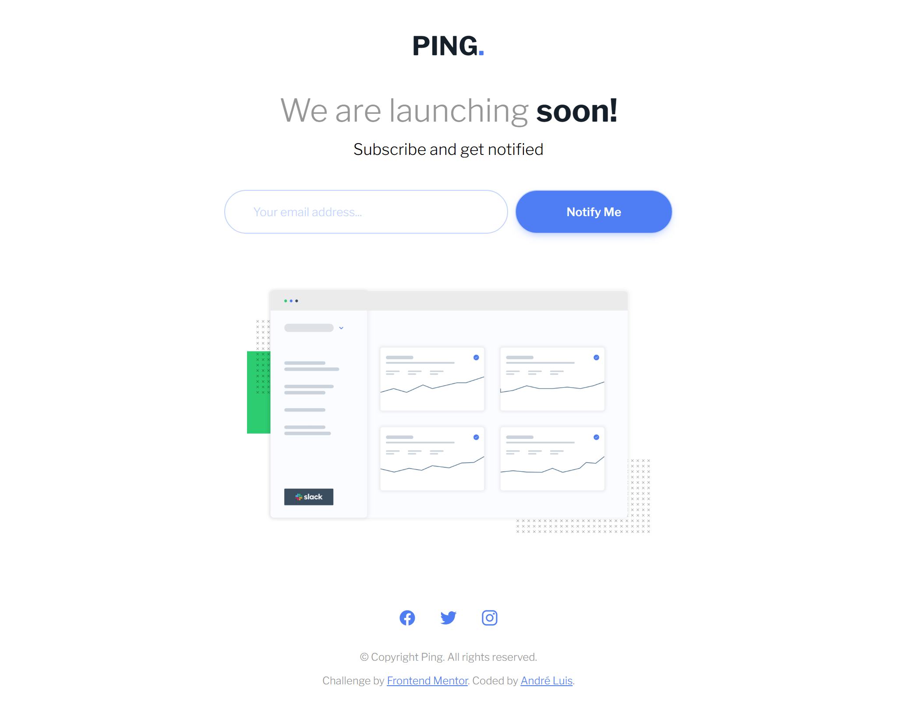

<h1 align="center"> Frontend Mentor - Ping coming soon page solution </h1>

This is a solution to the [Ping coming soon page challenge on Frontend Mentor](https://www.frontendmentor.io/challenges/ping-single-column-coming-soon-page-5cadd051fec04111f7b848da). Frontend Mentor challenges help you improve your coding skills by building realistic projects.

 

  <a href="#-tecnologias">Tecnologias</a>&nbsp;&nbsp;&nbsp;|&nbsp;&nbsp;&nbsp;
  <a href="#-projeto">Projeto</a>&nbsp;&nbsp;&nbsp;|&nbsp;&nbsp;&nbsp;
  <a href="#-screenshots">Screenshots</a>&nbsp;&nbsp;&nbsp;|&nbsp;&nbsp;&nbsp;
  <a href="#-links">Links</a>&nbsp;&nbsp;&nbsp;

 

## 🚀 Tecnologias

Esse projeto foi desenvolvido com as seguintes tecnologias:

- HTML, CSS e JS

## 💻 Projeto

O desafio era construir essa página implementando uma validação no input 'email', para isso, foi utilizado uma expressão regular com JS. Além disso, implementei um modal com CSS puro para confirmar o envio do formulário.

## 📸 Screenshots

  
  

## 🌎 Links

- Solution: 
- Live Site: 

---
